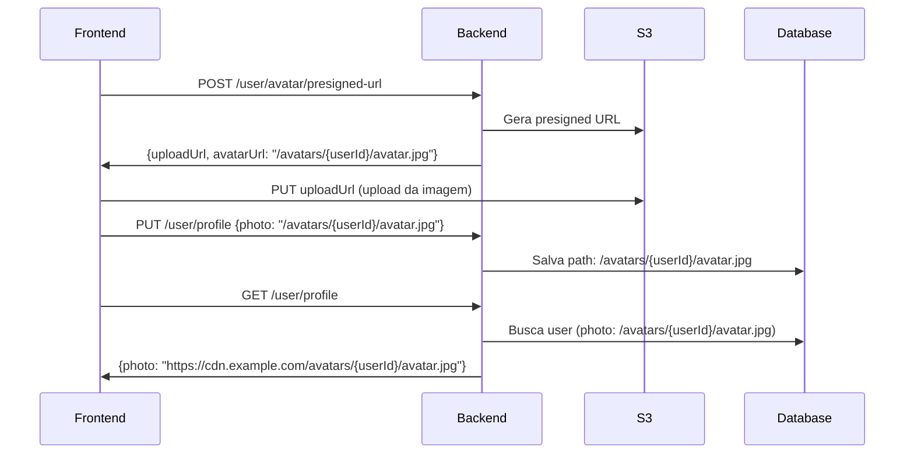

# Avatar Upload - Presigned URL

## Fluxo Completo



## Endpoint

```
POST /api/v1/user/avatar/presigned-url
```

## Headers

```
Authorization: Bearer <firebase-token>
```

## Request Body

```json
{
  "contentType": "image/jpeg",
  "fileSize": 1048576
}
```

### Validações

- **contentType**: Apenas `image/jpeg`, `image/jpg`, `image/png`, `image/webp`
- **fileSize**: Máximo 5MB (5242880 bytes)

## Response

```json
{
  "success": true,
  "data": {
    "uploadUrl": "https://bucket.s3.region.amazonaws.com/avatars/user-id/avatar.jpg?X-Amz-...",
    "avatarUrl": "/avatars/user-id/avatar.jpg",
    "expiresIn": 300
  },
  "message": "presigned URL generated successfully"
}
```

## Exemplo Frontend (JavaScript)

```javascript
// 1. Obter presigned URL
async function getAvatarUploadUrl(file) {
  const response = await fetch('/api/v1/user/avatar/presigned-url', {
    method: 'POST',
    headers: {
      'Authorization': `Bearer ${firebaseToken}`,
      'Content-Type': 'application/json'
    },
    body: JSON.stringify({
      contentType: file.type,
      fileSize: file.size
    })
  });
  
  return await response.json();
}

// 2. Fazer upload para S3
async function uploadAvatar(file) {
  // Validar no cliente antes
  const maxSize = 5 * 1024 * 1024; // 5MB
  const allowedTypes = ['image/jpeg', 'image/jpg', 'image/png', 'image/webp'];
  
  if (file.size > maxSize) {
    throw new Error('File too large. Maximum size is 5MB');
  }
  
  if (!allowedTypes.includes(file.type)) {
    throw new Error('Invalid file type. Only JPEG, PNG and WebP are allowed');
  }
  
  // Obter presigned URL
  const { data } = await getAvatarUploadUrl(file);
  
  // Upload direto para S3
  const uploadResponse = await fetch(data.uploadUrl, {
    method: 'PUT',
    headers: {
      'Content-Type': file.type,
    },
    body: file
  });
  
  if (!uploadResponse.ok) {
    throw new Error('Upload failed');
  }
  
  // 3. Atualizar profile com novo avatarUrl
  await updateProfile({
    photo: data.avatarUrl // Envia apenas o path: /avatars/{userId}/avatar.jpg
  });
  
  return data.avatarUrl;
}

// Exemplo de uso
const fileInput = document.querySelector('input[type="file"]');
fileInput.addEventListener('change', async (e) => {
  const file = e.target.files[0];
  if (file) {
    try {
      const avatarUrl = await uploadAvatar(file);
      console.log('Avatar uploaded:', avatarUrl);
      // avatarUrl será o path relativo: /avatars/{userId}/avatar.jpg
    } catch (error) {
      console.error('Upload error:', error.message);
    }
  }
});
```

## Exemplo GET Profile

```javascript
async function getUserProfile() {
  const response = await fetch('/api/v1/user/profile', {
    headers: {
      'Authorization': `Bearer ${firebaseToken}`
    }
  });
  
  const { data } = await response.json();
  
  // data.photo virá como URL completa com CDN
  console.log(data.photo); // https://cdn.example.com/avatars/{userId}/avatar.jpg
  
  // Usar diretamente no HTML
  document.querySelector('img').src = data.photo;
}
```

## Diferença entre Upload e GET

| Ação | Formato | Exemplo |
|------|---------|---------|
| **Upload (PUT profile)** | Path relativo | `/avatars/{userId}/avatar.jpg` |
| **Response (GET profile)** | URL completa com CDN | `https://cdn.example.com/avatars/{userId}/avatar.jpg` |
| **Salvo no banco** | Path relativo | `/avatars/{userId}/avatar.jpg` |

## Segurança Implementada

### ✅ Validações Server-Side

1. **Tipo de arquivo**: Apenas imagens JPEG, PNG e WebP
2. **Tamanho máximo**: 5MB
3. **Extensão validada**: Baseada no Content-Type
4. **Path gerado pelo servidor**: Usa `avatars/{userID}/{uuid}-{timestamp}.ext`
5. **Path do cliente ignorado**: Não aceita path enviado pelo cliente
6. **Expiração curta**: 5 minutos (300 segundos)
7. **Content-Type fixo**: Definido no presigned URL
8. **Autenticação**: Requer token Firebase válido

### 🔒 Estrutura do Path

**No S3:**
```
avatars/
  └── {userID}/
      └── avatar.{ext}
```

**Path salvo no banco de dados:**
```
/avatars/{userID}/avatar.jpg
```

**URL retornada ao frontend (GET profile):**
```
https://cdn.example.com/avatars/{userID}/avatar.jpg
```

Exemplo completo:
```
S3 Key: avatars/550e8400-e29b-41d4-a716-446655440000/avatar.jpg
DB Path: /avatars/550e8400-e29b-41d4-a716-446655440000/avatar.jpg
CDN URL: https://cdn.example.com/avatars/550e8400-e29b-41d4-a716-446655440000/avatar.jpg
```

### ⏱️ Tempo de Expiração

- **Upload URL**: 5 minutos
- Após expiração, novo presigned URL deve ser gerado

## Erros Comuns

### 400 Bad Request

```json
{
  "success": false,
  "message": "validation error",
  "errors": "..."
}
```

Causas:
- Content-Type inválido
- File size excede 5MB
- Campos obrigatórios ausentes

### 500 Internal Server Error

```json
{
  "success": false,
  "message": "file size exceeds maximum allowed size of 5242880 bytes"
}
```

ou

```json
{
  "success": false,
  "message": "invalid content type: image/gif. Allowed types: jpeg, jpg, png, webp"
}
```

## Configuração AWS S3

Certifique-se de que o bucket tenha:

1. **CORS configurado** para aceitar PUT requests:

```json
[
  {
    "AllowedHeaders": ["*"],
    "AllowedMethods": ["PUT", "GET"],
    "AllowedOrigins": ["https://your-frontend-domain.com"],
    "ExposeHeaders": ["ETag"]
  }
]
```

2. **Permissões IAM** adequadas:

```json
{
  "Version": "2012-10-17",
  "Statement": [
    {
      "Effect": "Allow",
      "Action": [
        "s3:PutObject",
        "s3:GetObject"
      ],
      "Resource": "arn:aws:s3:::your-bucket/avatars/*"
    }
  ]
}
```

## Configuração CDN

### Variável de Ambiente

Adicione ao arquivo `.env`:

```bash
CDN_DOMAIN=https://cdn.example.com
```

### Como Funciona

1. **Upload do Avatar:**
   - Frontend solicita presigned URL: `POST /user/avatar/presigned-url`
   - Backend retorna `uploadUrl` (S3) e `avatarUrl` (path relativo)
   - Frontend faz upload direto para S3 usando `uploadUrl`
   - Frontend atualiza profile com `avatarUrl`: `/avatars/{userId}/avatar.jpg`

2. **Salvamento no Banco:**
   - Backend salva apenas o path relativo: `/avatars/{userId}/avatar.jpg`
   - Não salva URL completa

3. **Recuperação do Avatar:**
   - Frontend solicita profile: `GET /user/profile`
   - Backend retorna `photo`: `https://cdn.example.com/avatars/{userId}/avatar.jpg`
   - CDN Domain é concatenado com o path do banco

### Configuração CloudFront (AWS CDN)

1. Criar distribuição CloudFront apontando para o bucket S3
2. Configurar origin:
   - Origin Domain: `your-bucket.s3.amazonaws.com`
   - Origin Path: (vazio)
3. Configurar comportamento:
   - Allowed HTTP Methods: GET, HEAD
   - Cache Policy: CachingOptimized
4. Usar o domain do CloudFront como `CDN_DOMAIN`

### Exemplo com CloudFront

```bash
# .env
CDN_DOMAIN=https://d1234567890abc.cloudfront.net
```

### Alternativas de CDN

- **AWS CloudFront**: Integração nativa com S3
- **Cloudflare**: Configure R2 ou proxy para S3
- **Fastly**: Configure origin para S3
- **Custom**: Qualquer CDN que suporte S3 como origin
