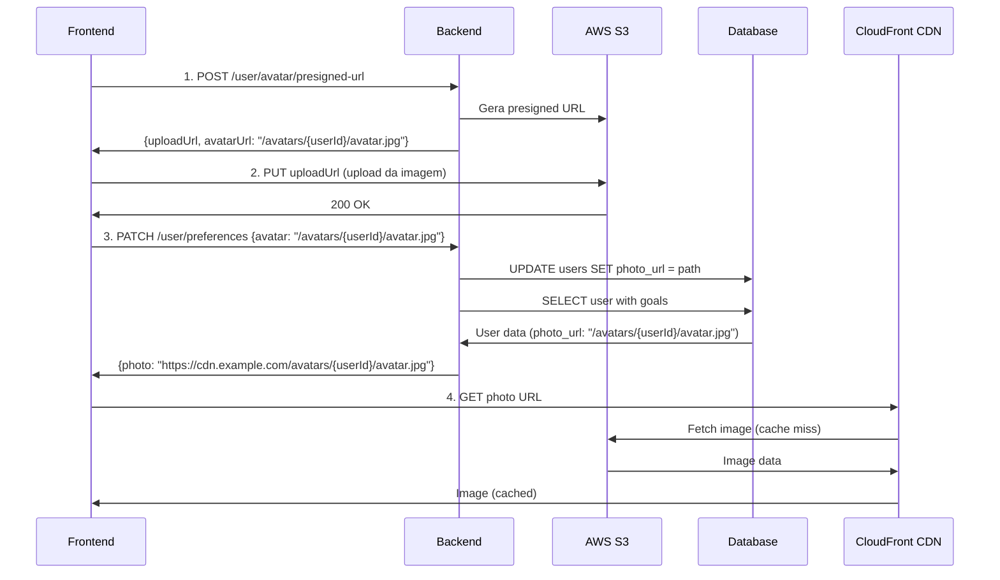

# PATCH User Preferences

## Visão Geral

Rota PATCH para atualizar preferências do usuário de forma granular, sem a necessidade de enviar todos os campos. Atualmente suporta apenas a atualização do avatar.

## Endpoint

```
PATCH /api/v1/user/preferences
```

## Headers

```
Authorization: Bearer <firebase-token>
Content-Type: application/json
```

## Diferença entre PUT e PATCH

| Método | Rota | Uso | Campos |
|--------|------|-----|--------|
| **PUT** | `/user/profile` | Atualização completa do perfil | Todos os campos obrigatórios |
| **PATCH** | `/user/preferences` | Atualização parcial de preferências | Apenas campos que deseja alterar |

## Request Body

### Atualizar Avatar

```json
{
  "avatar": "/avatars/550e8400-e29b-41d4-a716-446655440000/avatar.jpg"
}
```

### Campos Disponíveis

| Campo | Tipo | Obrigatório | Validação | Descrição |
|-------|------|-------------|-----------|-----------|
| `avatar` | string | ❌ | Deve começar com `/` | Path relativo do avatar no CDN |

## Response

### Success (200 OK)

```json
{
  "success": true,
  "data": {
    "id": "550e8400-e29b-41d4-a716-446655440000",
    "name": "John Doe",
    "email": "john@example.com",
    "photo": "https://cdn.example.com/avatars/550e8400-e29b-41d4-a716-446655440000/avatar.jpg",
    "dailyCalorieGoal": 2000,
    "dailyProteinGoal": 150,
    "dailyCarbsGoal": 200,
    "dailyFatGoal": 65,
    "weight": 75,
    "height": 175,
    "age": 30,
    "gender": "male",
    "activityLevel": "moderate",
    "language": "en-US",
    "notificationsEnabled": true,
    "createdAt": "2026-01-01T00:00:00Z",
    "updatedAt": "2026-01-19T00:00:00Z"
  },
  "message": "preferences updated successfully"
}
```

### Error (400 Bad Request)

```json
{
  "success": false,
  "message": "validation error",
  "errors": "Key: 'PatchUserPreferencesRequest.Avatar' Error:Field validation for 'Avatar' failed on the 'startswith' tag"
}
```

### Error (401 Unauthorized)

```json
{
  "success": false,
  "message": "unauthorized"
}
```

### Error (404 Not Found)

```json
{
  "success": false,
  "message": "user not found"
}
```

## Fluxo Completo de Upload de Avatar



## Exemplo Frontend (JavaScript)

```javascript
// Fluxo completo de upload de avatar
async function updateUserAvatar(file) {
  try {
    // 1. Validar arquivo
    const maxSize = 5 * 1024 * 1024; // 5MB
    const allowedTypes = ['image/jpeg', 'image/jpg', 'image/png', 'image/webp'];
    
    if (file.size > maxSize) {
      throw new Error('File too large. Maximum size is 5MB');
    }
    
    if (!allowedTypes.includes(file.type)) {
      throw new Error('Invalid file type');
    }
    
    // 2. Obter presigned URL
    const presignedResponse = await fetch('/api/v1/user/avatar/presigned-url', {
      method: 'POST',
      headers: {
        'Authorization': `Bearer ${firebaseToken}`,
        'Content-Type': 'application/json'
      },
      body: JSON.stringify({
        contentType: file.type,
        fileSize: file.size
      })
    });
    
    const { data: presignedData } = await presignedResponse.json();
    
    // 3. Upload direto para S3
    const uploadResponse = await fetch(presignedData.uploadUrl, {
      method: 'PUT',
      headers: {
        'Content-Type': file.type,
      },
      body: file
    });
    
    if (!uploadResponse.ok) {
      throw new Error('Upload failed');
    }
    
    // 4. Atualizar preferências do usuário com PATCH
    const patchResponse = await fetch('/api/v1/user/preferences', {
      method: 'PATCH',
      headers: {
        'Authorization': `Bearer ${firebaseToken}`,
        'Content-Type': 'application/json'
      },
      body: JSON.stringify({
        avatar: presignedData.avatarUrl // "/avatars/{userId}/avatar.jpg"
      })
    });
    
    const { data: userData } = await patchResponse.json();
    
    // 5. Usar a URL completa com CDN
    console.log('Avatar updated:', userData.photo);
    // https://cdn.example.com/avatars/{userId}/avatar.jpg
    
    return userData.photo;
    
  } catch (error) {
    console.error('Failed to update avatar:', error.message);
    throw error;
  }
}

// Uso com input file
document.querySelector('#avatarInput').addEventListener('change', async (e) => {
  const file = e.target.files[0];
  if (file) {
    const avatarUrl = await updateUserAvatar(file);
    document.querySelector('#avatarPreview').src = avatarUrl;
  }
});
```

## Exemplo com React

```typescript
import { useState } from 'react';

interface AvatarUploadProps {
  firebaseToken: string;
}

export function AvatarUpload({ firebaseToken }: AvatarUploadProps) {
  const [uploading, setUploading] = useState(false);
  const [avatarUrl, setAvatarUrl] = useState<string | null>(null);

  const handleFileChange = async (e: React.ChangeEvent<HTMLInputElement>) => {
    const file = e.target.files?.[0];
    if (!file) return;

    setUploading(true);

    try {
      // 1. Get presigned URL
      const presignedRes = await fetch('/api/v1/user/avatar/presigned-url', {
        method: 'POST',
        headers: {
          'Authorization': `Bearer ${firebaseToken}`,
          'Content-Type': 'application/json'
        },
        body: JSON.stringify({
          contentType: file.type,
          fileSize: file.size
        })
      });

      const { data: presigned } = await presignedRes.json();

      // 2. Upload to S3
      await fetch(presigned.uploadUrl, {
        method: 'PUT',
        headers: { 'Content-Type': file.type },
        body: file
      });

      // 3. Update user preferences
      const patchRes = await fetch('/api/v1/user/preferences', {
        method: 'PATCH',
        headers: {
          'Authorization': `Bearer ${firebaseToken}`,
          'Content-Type': 'application/json'
        },
        body: JSON.stringify({ avatar: presigned.avatarUrl })
      });

      const { data: user } = await patchRes.json();
      setAvatarUrl(user.photo);

    } catch (error) {
      console.error('Upload failed:', error);
    } finally {
      setUploading(false);
    }
  };

  return (
    <div>
      <input
        type="file"
        accept="image/jpeg,image/jpg,image/png,image/webp"
        onChange={handleFileChange}
        disabled={uploading}
      />
      {uploading && <p>Uploading...</p>}
      {avatarUrl && }
    </div>
  );
}
```

## Vantagens do PATCH

1. **Economia de dados**: Envia apenas o que mudou
2. **Performance**: Menos processamento no backend
3. **Flexibilidade**: Fácil adicionar novos campos no futuro
4. **Semântica correta**: PATCH é o método HTTP correto para atualizações parciais
5. **UX melhorada**: Frontend não precisa manter estado completo do usuário

## Campos Futuros (Roadmap)

A rota PATCH foi desenhada para ser extensível. Campos planejados:

```json
{
  "avatar": "/avatars/{userId}/avatar.jpg",
  "language": "pt-BR",
  "notificationsEnabled": false,
  "theme": "dark",
  "timezone": "America/Sao_Paulo"
}
```

Cada campo é opcional e será atualizado individualmente.

## Validações

### Avatar

- ✅ Deve começar com `/` (path relativo)
- ✅ Formato: `/avatars/{userId}/avatar.{ext}`
- ✅ Extensões válidas: `.jpg`, `.png`, `.webp`
- ❌ Não aceita URLs completas
- ❌ Não aceita paths arbitrários

### Exemplos Válidos

```json
{"avatar": "/avatars/550e8400-e29b-41d4-a716-446655440000/avatar.jpg"}
{"avatar": "/avatars/550e8400-e29b-41d4-a716-446655440000/avatar.png"}
{"avatar": "/avatars/550e8400-e29b-41d4-a716-446655440000/avatar.webp"}
```

### Exemplos Inválidos

```json
{"avatar": "https://cdn.example.com/avatars/user/avatar.jpg"}  // URL completa
{"avatar": "avatars/user/avatar.jpg"}                          // Sem / no início
{"avatar": "/custom/path/image.jpg"}                           // Path arbitrário
```

## Comparação com PUT

### PUT /user/profile

```json
{
  "id": "550e8400-e29b-41d4-a716-446655440000",
  "name": "John Doe",
  "email": "john@example.com",
  "photo": "/avatars/550e8400-e29b-41d4-a716-446655440000/avatar.jpg",
  "dailyCalorieGoal": 2000,
  "dailyProteinGoal": 150,
  "dailyCarbsGoal": 200,
  "dailyFatGoal": 65,
  "weight": 75,
  "height": 175,
  "age": 30,
  "gender": "male",
  "activityLevel": "moderate",
  "language": "en-US",
  "notificationsEnabled": true
}
```

**Todos os campos são obrigatórios**

### PATCH /user/preferences

```json
{
  "avatar": "/avatars/550e8400-e29b-41d4-a716-446655440000/avatar.jpg"
}
```

**Apenas o campo que você quer atualizar**

## Segurança

- ✅ Autenticação obrigatória via Firebase
- ✅ Validação de path do avatar
- ✅ Usuário só pode atualizar seu próprio perfil
- ✅ Validação de formato e estrutura
- ✅ Rate limiting (via middleware global)

## Status Codes

| Code | Descrição |
|------|-----------|
| `200` | Preferências atualizadas com sucesso |
| `400` | Validação falhou ou body inválido |
| `401` | Token Firebase inválido ou ausente |
| `404` | Usuário não encontrado |
| `500` | Erro interno do servidor |
